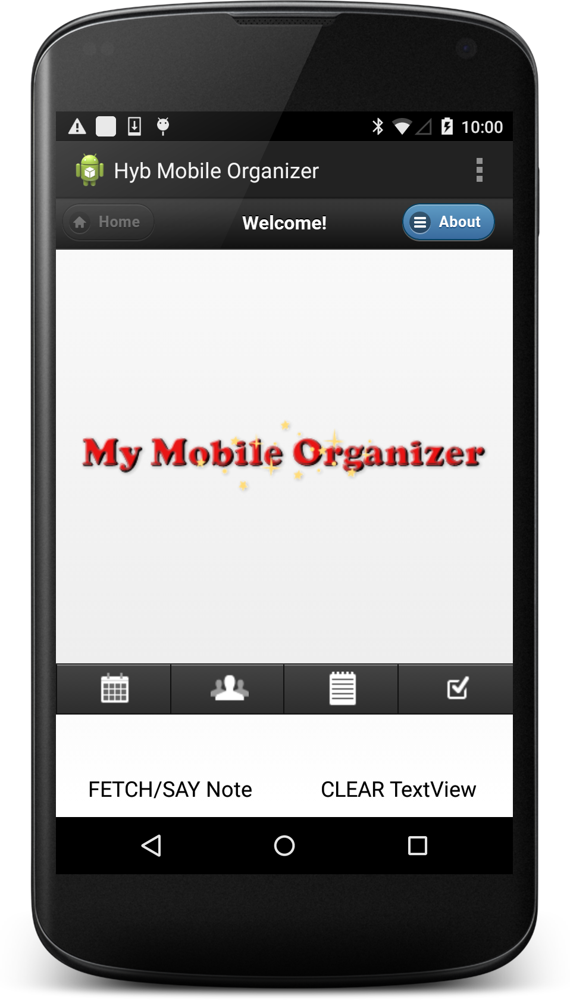

## demoHybridMyMblOrgnzr
Demo app using WebView in a Hybrid Android app

###### Acknowledgements
The web app portion of this demo app is mostly the client-side teaching app freely available from the book [Pro iOS and Android Apps for Business with jQuery Mobile, node.js, and MongoDB](http://www.apress.com/9781430260707) by Frank Zammetti, augmented with additional features. Code for the web app portion is in the `./assets/www/` folder.

In order to run the web app portion of the demo app, we also use the server-side teaching app from the above book, with some minor fixes in the db schema for 'note' and for a typo in the console log message for the GET() function. Code for the server, which is run separately as the backend, is in the `./server/` folder for convenience.

This demo app also uses two Java classes (plus a couple more dependent classes) from the open source [karura](https://github.com/karuradev/karura) framework. The demo app demonstrates some of the many good ideas and pointers described in the karura framework's companion book (which contains not much actual code examples), but does not use the framework per se. We use four Java classes from the framework, and they are placed in the `./src/com/karura/framework/` path as required by their package.

###### git configuration
Our code was written on Mac OS X. But it appears that code from the Pro iOS and Android Apps book was written on Windows. To avoid very annoying line-ending characters showing up when you do "git diff", set the following git configuration for [Dealing with line endings](https://help.github.com/articles/dealing-with-line-endings). Be aware that git would issue a warning when it does a transparent replacement of line-ending characters, but git would also explain that the file will have its original line endings in your working directory; so don't be alarmed by such warnings.

* On Mac OS X
```
git config --global core.autocrlf input
```
* On Windows
```
git config --global core.autocrlf true
```

#### Steps to run demo app



##### Downloads and installation
* Clone this repository to get your own local git repo at `[PathToGitRepoBase]/`
* [Download Android Studio](https://developer.android.com/sdk/index.html) if you don't have it
* Run Android Studio > Welcome to Android Studio > Configure > SDK Manager, install following if not installed
 * `Android 5.0.1 (API 21)` SDK Platform
 * Tools `Android SDK Build-tools 21.1.2`
* Go here to [Install Node.js](http://nodejs.org).
* Go here to [Install MongoDB](http://docs.mongodb.org/manual/installation/).
* Get MongoDB object modeling for Node.js by installing Mongoose module
```
npm install mongoose
```

##### Set up USB debugging
* Connect up your Android device to your host development computer using USB; to set up remote debugging:
 * First do [Setting up your Android device - Enable USB debugging](https://developer.chrome.com/devtools/docs/remote-debugging#enable-usb-debug)
 * On development Host machine, start Chrome browser (v39+), then do [Discovering devices in Chrome](https://developer.chrome.com/devtools/docs/remote-debugging#discovering-devices) to Discover USB devices conected to the Host development machine
 * At this point, we should see on Host browser's `chrome://inspect` page, the Android device, e.g. Nexus x, listed in Devices

##### Android Studio
* Select "Open an existing Android Studio project" or Open project > `[PathToGitRepoBase]/demoHybridMyMblOrgnzr20nn > Choose`. (Don't select "Import project".)
 * If see popup "Unregistered VCS root detected", click "Add root" to specify "Git" as VCS for current project
* In `app/build.gradle` file, we have specified compileSdkVersion 21, minSdkVersion 21, targetSdkVersion 21 i.e. Android 5 or API Level 21. If not already done, use `Tools > Android > SDK Manager` to download the needed SDK platform. (Note that minSdkVersion and targetSdkVersion values appear to override the corresponding values specified in the `AndroidManifest.xml` file.)
* There should be no build errors for the project at this point
* At this point, we should be able to run the demo app on the Android device, but until the rest of the setup steps are done, be aware that the app will show an error Alert popup displaying some json object values such as `XHR:{"readyState":0...` as well as a `No Network Connection` error Dialog. But to verify that the demo app runs:
 * Run > Run 'app' > Choose a running device: pick your 'Online' Android device > OK
 * Dismiss the error Alert (it should self dismiss) and the error Dialog
 * See the demo app's main activity screen, comprising a WebView occupying most of the screen, two bar-buttons at the bottom of the screen, and an empty single line TextView immediately above them

##### Run backend for the web app portion of the demo app
The backend processes *MUST be run in the following order* (see `./server/run.bat` for Windows)
* Open Terminal (e.g. iTerm2 for a Mac) to run MongoDB daemon
```
cd [PathToGitRepoBase]/demoHybridMyMblOrgnzr20nn/server/
sudo mongod --dbpath ./db/
Password:[enteradminpassword]
```
* Open another Terminal to run Node.js server code that is in main.js (e.g. iTerm2 for Mac, menu Shell > Split Horizontally With Current Profile)
```
cd [PathToGitRepoBase]/demoHybridMyMblOrgnzr20nn/server/
sudo node ./main.js

App available at http://127.0.0.1:80
```

##### Set up Port forwarding between Android device and development Host
* Chrome for Android supports [Port forwarding](https://developer.chrome.com/devtools/docs/remote-debugging#port-forwarding)
 * First, start Chrome for Android browser (v39+) on the Android device
 * Caveat -- Chrome DevTools may crash the demo app with a "Fatal signal 11 (SIGSEGV) at 0x00000014 (code=1)..." logged in LogCat if Chrome for Android browser is not running on the Android device _before_ setting up "Port forwarding" in Development host's Chrome browser as described below
 * On development Host browser's `chrome://inspect` page, we should now see the Chrome for Android listed below the Android device; follow "To enable port forwarding:" section in above "Port forwarding" link, and set `Device Port: 8080`, set `Host IP address and port: 127.0.0.1:80`
 * Make sure to select "Enable port forwarding" checkbox before hitting "Done" in the dialog popup for "Port forwarding"
 * At this point, refresh Host browser's `chrome://inspect` page and we should see a green circle indicating port forwarding success

##### Test web app connectivity
* To restart the demo app after connectivity is set up, use the trick of changing Android device orientation to landscape (and back to portrait for easier UI)
* We should not see the error Alert or error Dialog from the web app in the restarted demo app

##### Test round-trip interaction between web app and native Android functionalities
* First enter some data in web app (running in WebView); enter a Notes entry
 * Select 'notepad' icon on menu bar at bottom of the WebView; touch round menu icon on top right > New
 * Enter in 'Title' box, example: Send not
 * Enter in 'Text' box, example: Therefore, send not to know for whom the bell tolls, it tolls for thee.
 * Save
* Next enter a couple of contacts using the pre-loaded "Contacts" app in Android
 * "Contacts" app > press 'add' icon at bottom
 * First contact: 'Name' (Enter firstname lastname), 'Phone' (Enter number, then select HOME in dropdown) > Done
 * Second contact: 'Name' (Enter firstname lastname), 'Phone' (Enter number, then select MOBILE in dropdown), 'Email' (Enter email address, then select HOME in dropdown) > Done
* Demo/Test roundtrip calling from: Android Java code, to JavaScript code in WebView, and back to Android functionality in Java code
 * Touch native Android bar-button "FETCH/SAY Note", get first note entry in web app, then hear Android say it with native TextToSpeech
* Demo/Test roundtrip calling from: JavaScript code in web app, to native Android Java code, and back to JavaScript code in web app
 * Select 'contact' icon on menu bar at bottom of the WebView; touch round menu icon on top right > Fetch Contacts, call Java code to get the Android contacts stored by the "Contacts" app, then return the Android contacts to JavaScript code to be stored in the web app
